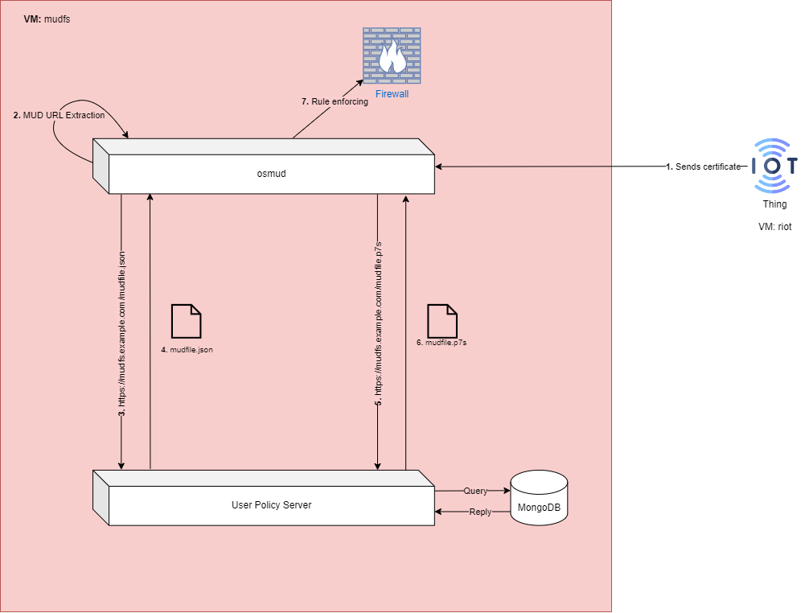

***DISCLAIMER***      Quest'architettura nasce dal fatto che le estensioni per MUD non vengono inserite nel self-signed certificate. Tuttavia, è ancora in fase di studio; quindi, potrebbe differire da quella finale.

1. L'IoT device invia la Certificate Sign Request (CSR, d'ora in avanti) ad osmud, il quale gira sulla macchina in cui è stata creata la CA. Nella CSR è contenuta l'estensione con il riferimento al MUD URL, che verrà utilizzata per l'estrazione delle regole di firewall.
2. Osmud procede ad estrarre l'URL, che verrà utilizzato per la richiesta del MUD file al MUD file server (o UPS, come in foto)
3. Osmud invia la richiesta all'UPS per ottenere il MUD file.
4. UPS risponde con MUD file.
5. Osmud invia la richiesta di firma del MUD file.
6. UPS risponde con firma.
7. Osmud procede ad eseguire l'enforcement delle regole di firewall
8. La CA presente sulla macchina che ospita osmud firma la CSR
9. Il server invia il certificato al dispositivo IoT e procede ad eliminare la CSR.

### PRO

- Riutilizzo della CA creata nel deployment di MUD con DHCP.
- Maggiore sicurezza, poiché i dispositivi comunicanti sono trusted l'uno con l'altro.

### CONTRO
- Il server può diventare un bottleneck nel caso in cui il numero di dispositvi sia molto elevato. Questo, perché quella macchina deve firmare il certificato e completare tutta la procedura di estrazione e richiesta del MUD file, più rule enforcement. Si potrebbe pensare di inviare a osmud dei certificati *self-signed*, ma è sempre meglio averne di firmati dalla CA, per motivi di sicurezza. Una soluzione potrebbe essere quella di dividere i compiti; quindi, avere una macchina che si occupa di firmare i certificati e rilasciarli sia alla Thing che ad osmud, il quale si occuperà dei suoi soliti compiti (vedi diagramma sotto).

	In questo caso, basta copiare il certificato della CA creata nel caso DHCP nella nuova macchina. Di base, ciò vuol dire dividere i compiti in due macchine distinte. Ciò mi permetterebbe anche di spostare il MUD File Server nell'altra macchina senza problemi, così da rispettare le disposizioni dello standard.

### Altra soluzione

Il manufacturer ci dà a disposizione la *thing* con già il certificato, così che essa possa mandarlo al mud manager. Ovviamente, quest'ultimo deve conoscere e quindi fidarsi della CA.

# Questa architettura è legit?

La specifica MUD dice che: 

>[!QUOTE] Section 11 of RFC 8520
>
>[...] a separate new extension is defined as **id-pe-mudsigner**. This **contains the subject field of the signing certificate of the MUD file**.  Processing of this field is specified in [Section 13.2](https://datatracker.ietf.org/doc/html/rfc8520#section-13.2). 
   The purpose of this signature is to **make a claim that the MUD file**
   **found on the server is valid for a given device**, independent of any
   other factors.  [...]
   A new content-type **id-ct-mud** is also defined.  While signatures are
   detached today, **should a MUD file be transmitted as part of a**
   **Cryptographic Message Syntax (CMS) message**, this content-type SHOULD
   be used.

> [!QUOTE] Section 13.2 of RFC 8520
> 
> When the id-pe-mudsigner extension is present in a device's X.509 certificate, **the MUD signature file MUST have been generated by a certificate whose subject matches the contents of that id-pe-mudsigner extension**.  If these conditions are not met, or if it cannot validate the chain of trust to a known trust anchor, the MUD manager MUST cease processing the MUD file until an administrator has given approval.  
   The purpose of the signature on the file is to assign accountability
   to an entity, whose reputation can be used to guide administrators on
   whether or not to accept a given MUD file.  **It is already common**
   **place to check web reputation on the location of a server on which a**
   **file resides.**  While it is likely that the manufacturer will be the
   signer of the file, this is not strictly necessary, and it may not be
   desirable.  For one thing, in some environments, integrators may
   install their own certificates.  For another, what is more important
   is the accountability of the recommendation, and not just the
   relationship between the Thing and the file.
   

# Appunti call del 16 ottobre 2024

![[Pasted image 20241016135327.png]]quando IoT invia cert a osmud, osmud controlla che sia stato firmato dalla CA del manufacturer (subject). successivamente, estrare il mud URL e controlla che punti al mudfs del manufacturer (mudsigner).