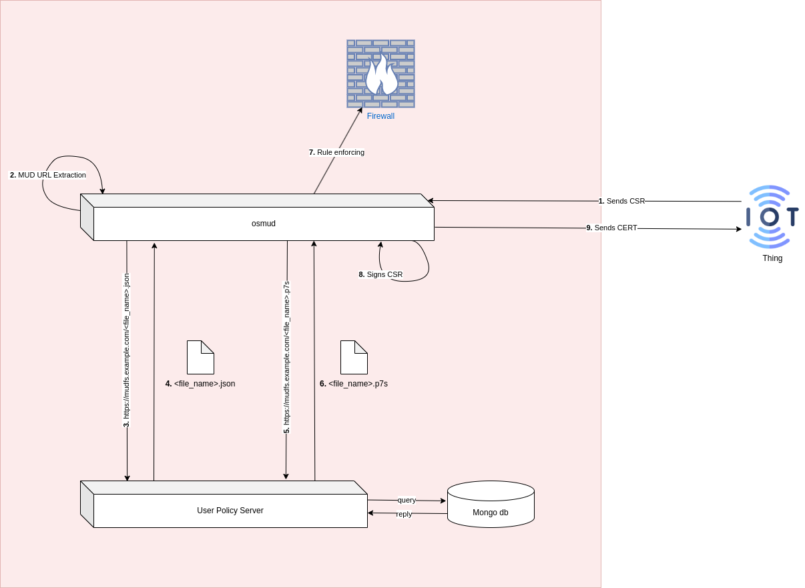
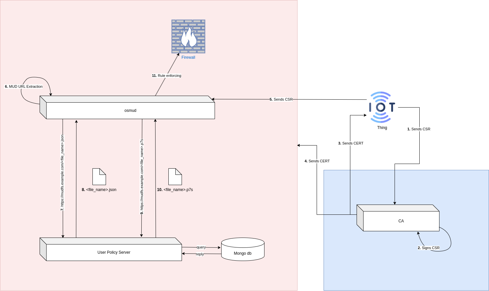

***DISCLAIMER***      Quest'architettura nasce dal fatto che le estensioni per MUD non vengono inserite nel self-signed certificate. Tuttavia, è ancora in fase di studio; quindi, potrebbe differire da quella finale.

1. L'IoT device invia la Certificate Sign Request (CSR, d'ora in avanti) ad osmud, il quale gira sulla macchina in cui è stata creata la CA. Nella CSR è contenuta l'estensione con il riferimento al MUD URL, che verrà utilizzata per l'estrazione delle regole di firewall.
2. Osmud procede ad estrarre l'URL, che verrà utilizzato per la richiesta del MUD file al MUD file server (o UPS, come in foto)
3. Osmud invia la richiesta all'UPS per ottenere il MUD file.
4. UPS risponde con MUD file.
5. Osmud invia la richiesta di firma del MUD file.
6. UPS risponde con firma.
7. Osmud procede ad eseguire l'enforcement delle regole di firewall
8. La CA presente sulla macchina che ospita osmud firma la CSR
9. Il server invia il certificato al dispositivo IoT e procede ad eliminare la CSR.

### PRO

- Riutilizzo della CA creata nel deployment di MUD con DHCP.
- Maggiore sicurezza, poiché i dispositivi comunicanti sono trusted l'uno con l'altro.

### CONTRO
- Il server può diventare un bottleneck nel caso in cui il numero di dispositvi sia molto elevato. Questo, perché quella macchina deve firmare il certificato e completare tutta la procedura di estrazione e richiesta del MUD file, più rule enforcement. Si potrebbe pensare di inviare a osmud dei certificati *self-signed*, ma è sempre meglio averne di firmati dalla CA, per motivi di sicurezza. Una soluzione potrebbe essere quella di dividere i compiti; quindi, avere una macchina che si occupa di firmare i certificati e rilasciarli sia alla Thing che ad osmud, il quale si occuperà dei suoi soliti compiti (vedi diagramma sotto).

	In questo caso, la nuova CA deve firmare anche il certificato della macchina in cui è ospitato tutto il backend (osmud+UPS); quindi, per riutilizzare la stessa CA