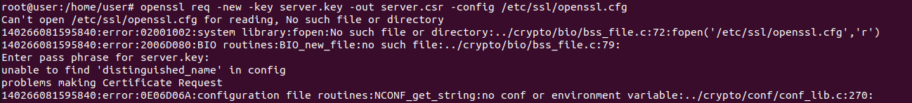
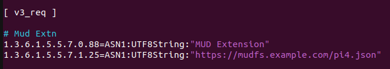

- 26/09/2024
	- Tried putting the following lines into /etc/ssl/openssl.cnf under [v3_req] section.
	  
		    
			1.3.6.1.5.5.7.0 =critical
			1.3.6.1.5.5.7.1.25 = ASN1:UTF8String:"https://mudfs.example.com/fe-localnetwork-to.json"
	-  Ran the first two commands specified in [[Appunti#Create a X509 Cert with Custom Extension]], and turned the result shown in the picture below:
	  
	

 - 05/10/2024
	 - Put the followings into /etc/ssl/openssl.cnf

	
 	and

	- Ran every step of [[Appunti#Create a X509 Cert with Custom Extension]]
	
**RESULT**: The certificate is generated successfuly, BUT it doesn't show any extension when running `openssl x509 -noout -text -in server.pem -ext all`:

